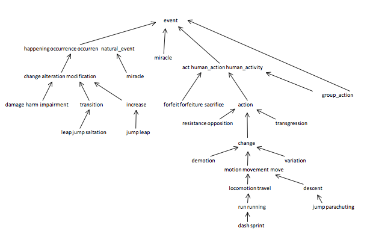

## Coursera Algorithms, Princeton University (Part I)

### Assignment 1: Percolation
*Score*: 95%

*Example*: `> java PercolationStats 200 100`

*Comments*: One snag in implementing the `percolates()` method in `Percolation` is that if you use a virtual top and bottom, it's not true that every point connected to the virtual bottom percolates once the system percolates.  Therefore, in the `open()` method, perform the following check at the end:

```Java
public Class Percolation() {
  ...

  public void open(int row, int col) {
    ...
        // lastly, check if the cell is now full.
        if (isFull(row, col)) {
            for (int j = 1; j <= size; j++) {
                if (!isOpen(size, j)) {
                    continue;
                } else if (isFull(size, j)) { // check if any bottom row have percolated
                    sites.union(xyTo1D(size, j), bottom); // <- connect to virtual bottom
                }
            }
        }
  } // end open
} // end Percolation
```

You can use the `PercolationVisualizer` to visualize the percolation (and compare your results with the ones given)


### Assignment 2: Queues
*Score*: 95%

*Example*: `>java Permutation 8 < duplicates.txt`

*Comments*: The `RandomizedQueue` should dequeue a random object.  This can be achieved without shuffling by exchanging indexes at the front of the queue as shown below.

```java
public Item dequeue() {
        if (isEmpty()) {
            throw new NoSuchElementException("Queue underflow");
        }

        int r = StdRandom.uniform(0, n);
        exchange(r, n - 1);

        Item hold = q[--n];
        q[n] = null;

        if (n > 0 && n == (q.length / 4)) {
            resize(q.length / 2);
        }

        return hold;
}
```

### Assignment 3: Collinear
*Score*: 94%

*Example*: `> java FastCollinearPoints input8.txt`

*Comments*: Tough assignment where the trick is to figure out how to input the maximal line segment without duplicates.  The trick is figuring out how to implement a private `sort(Point[] p, Comparator<Point> c)` method in `FastCollinearPoints`.  You can use the `Sample` client code in `tests` to generate visualizations of the collinear lines.


### Assignment 4: 8 Puzzle
*Score*: 84%

*Example*: `> java PuzzleChecker puzzle08.txt`

*Comments*: The key to understanding how to solve the 8 puzzle is to recognize that one and only one of an 8 puzzle and it's 'twin' can be solved.  This property yields an interesting method for implementing the `Solver` class.  With two separate priority queues, an 8 puzzle's twin is solved simultaneously with the original puzzle.  If the twin is solved, then the puzzle is unsolvable.  This optimization prevents endless repetition of moves that do not solve the puzzle, a key problem when employing the A* search method.  The private `simultaneousSolution` method is shown below:

```java
private SearchNode simultaneousSolution() {

        SearchNode origSearchNode = new SearchNode(original, 0, null);
        SearchNode twinSearchNode = new SearchNode(twin, 0, null);

        pqOrig.insert(origSearchNode);
        pqTwin.insert(twinSearchNode);

        while (!origSearchNode.isSolved() && !twinSearchNode.isSolved()) {
            origSearchNode = nextSearchNode(pqOrig);
            twinSearchNode = nextSearchNode(pqTwin);
        }

        return origSearchNode;
}
```


### Assignment 5: KD Tree
*Score*: 95%

*Example*: `> java KdTreeGenerator input80K.txt`

*Comments*: This assignment uses Kd-Trees to implement a 2d range search.  In a search for a 2d point, the search function will traverse through nodes, alternating the axis on which a vertical or horizontal linear split occurs.  Points are bounded by rectangles that are the composite of splits occurring until the Point is located or a leaf node is created.  Since the rectangles themselves are not a guarantee of a nearest neighbor for a particular search point, nearby nodes need to be searched as well, creating an opportunity to implement an optimized search algorithm.  My implementation of the `nearest` method is shown below:

```java
private void nearest(Node x, Point2D p, boolean orientation) {

        if (x == null) return;

        if (minDist < x.rect.distanceSquaredTo(p)) {
            return; // no need to continue searching node or subtrees
        } else {
            // search the node
            if (x.p.distanceSquaredTo(p) < minDist) {
                min = x.p;
                minDist = min.distanceSquaredTo(p);
            }
            // choose which subtree to search first if both available to search
            if (x.lb != null && x.rt != null) {
                Comparator<Point2D> comparator = orientation ? Point2D.X_ORDER : Point2D.Y_ORDER;
                int cmp = comparator.compare(p, x.p);
                if (cmp < 0) {
                    nearest(x.lb, p, !orientation); // search left first
                    if (x.rt.rect.distanceSquaredTo(p) < minDist) nearest(x.rt, p, !orientation); // search right second
                } else {
                    nearest(x.rt, p, !orientation);
                    if (x.lb.rect.distanceSquaredTo(p) < minDist) nearest(x.lb, p, !orientation); // search left second
                }
            } else if (x.lb == null) { // only right subtree can be searched
                nearest(x.rt, p, !orientation);
            } else { // only left subtree can be searched
                nearest(x.lb, p, !orientation);
            }
      }
}
```


## Coursera Algorithms, Princeton University (Part II)

### Assignment 1: WordNet
*Score*: 100%

*Example*: `> java WordNet synsets.txt hypernyms.txt`

*Comments*: This assignment is about finding shortest paths in a Directed Acyclic Graph (DAG).  The assignment is easy to solve using the `BreadthFirstDirectedPaths` class in `algs4.jar`, however the bigger challenge than arriving at a correct solution is speeding up the implementation.  I implemented a private `dfs` (depth first search) method in the `SAP` (shortest ancestral path) class which adds to a cache that can be used to skip over redundant calculations.  Additionally, I avoid the overhead associated with calls to `BreadthFirstDirectedPaths`, which initializes several G.V()-sized arrays on each instance, by keeping track of changes to the `marked` and `distTo` instance variables and re-initializing only the values that change on each function call to `dfs`.  The `dfs` method is shown below:

```java
private ST<Integer, Integer> dfs(int v) {

        if (cache.contains(v)) return cache.get(v);

        assert isArrayCleared();

        ST<Integer, Integer> st = new ST<>();

        Stack<Integer> visited = new Stack<>();

        Queue<Integer> queue = new Queue<>();
        marked[v] = true;
        distTo[v] = 0;
        st.put(v, distTo[v]);
        queue.enqueue(v);
        visited.push(v);

        while (!queue.isEmpty()) {
            int x = queue.dequeue();
            for (int y : G.adj(x)) {
                if (!marked[y]) {
                    distTo[y] = distTo[x] + 1;
                    marked[y] = true;
                    st.put(y, distTo[y]);
                    queue.enqueue(y);
                    visited.push(y);
                }
            }
        }
        cache.put(v, st);

        clearArraysSoft(visited);

        return st;
}
```



### Assignment 2: SeamCarver
*Score*: 94%

*Example*: `> java ResizeDemo HJocean.png`

*Comments*: Unsure about the autograder output on this assignment.  I probably could eliminate some memory usage in the instance variables, but I wasn't able to find a way to do this that would maintain performance.  This assignment is about finding a shortest path in an edge-weighted acyclic digraph.  Seam carving is a 'content-aware' image resizing technique because it  finds pixels that are connected (one per row or column) and removes the 'minimum energy' row or column of pixels.  This technique effectively minimizes the visual impact of removing pixels from an image from the viewers perspective.  The shortest path algorithm is relatively straightforward, however some of the optimizations can be a bit tricky to implement because working with arrays in Java can be a bit confusing.  One reason for this is that removing pixel values horizontally from a matrix that stores rows is column-major order (i.e. the default access method of the Picture class), will result in a mis-shaped array.  The solution is to use a class variable to keep track of the *original* orientation of the picture as given to the class constructor and implement private methods to handle transposition operations.  An example of this is how the public `energy` method is implemented:
```java
public double energy(int col, int row) {
    if ((col < 0 || col >= width) || (row < 0 || row >= height)) {
        throw new IllegalArgumentException("Error: Coordinates out of bounds");
    }

    // must assume the client is calling the picture from perspective of original orientation
    if (direction == ORIGINAL) {
        return energy[row][col];
    } else {
        return energy[col][row];
    }
}
```


### Assignment 3: BaseballElimination
*Score*: 100%

*Example*: `> java BaseballElimination teams4.txt`

*Comments*: The trick to figuring out this assignment is setting up the flow network correctly.  Since the `FlowNetwork` does not include the team being queried, the vertices have to be carefully connected so that the `FlowEdge` objects point to the correct vertices.  One hack I used was to keep track of the team vertices by putting them into a symbol table.  It's not the neatest solution, but I found that keeping track of which game vertices were pointing to which team vertices was too complex otherwise.  I used a class variable called `subset` to keep track of which teams will eliminate R given the min s-t cut (or by trivial elimination).  I include the code for `createFlowNetwork` below:

```java
private FlowNetwork createFlowNetwork(int idx) {

        // n choose 2 (excluding the team with index idx)
        int numGames = 0;
        for (int i = 0; i < numTeams; i++) {
            if (i == idx) continue;
            for (int j = (i + 1); j < numTeams; j++) {
                if (j == idx) continue;
                numGames++;
            }
        }

        // set source vertex and sink vertex
        numVertices = numGames + (numTeams - 1) + 2;
        int source = 0;
        int sink = numVertices - 1;

        // set team vertices by index
        ST<Integer, Integer> vertex = new ST<>(); // ST<Team Number, Vertex>
        int c = 1 + numGames; // beginning index of team vertices
        for (int i = 0; i < numTeams; i++) {
            if (i == idx) continue;
            vertex.put(i, c++);
        }

        // initialize flow network with vertices
        FlowNetwork network = new FlowNetwork(numVertices);

        FlowEdge gameEdge;  // source -> game edges
        FlowEdge r1;        // result 1 -> team
        FlowEdge r2;        // result 2 -> team
        FlowEdge teamEdge;  // team vertices -> sink edge

        c = 1;              // current index of the game vertices
        for (int i = 0; i < numTeams; i++) {
            if (i == idx) continue;
            for (int j = i + 1; j < numTeams; j++) {
                if (j == idx) continue;

                // gameEdge between teams i and j
                gameEdge = new FlowEdge(source, c, against[i][j]);
                network.addEdge(gameEdge);

                // assign possible results to network
                int w = vertex.get(i); // index of team i vertex
                int y = vertex.get(j); // index of team j vertex

                r1 = new FlowEdge(c, w, Double.POSITIVE_INFINITY);
                network.addEdge(r1);

                r2 = new FlowEdge(c, y, Double.POSITIVE_INFINITY);
                network.addEdge(r2);

                c++; // increment game pair counter
            }
        }

        for (Integer j : vertex.keys()) {
            int w = vertex.get(j);
            teamEdge = new FlowEdge(w, sink, (wins[idx] + remaining[idx] - wins[j]));
            network.addEdge(teamEdge);
        }

        FordFulkerson ff = new FordFulkerson(network, 0, numVertices - 1);

        subset = new SET<>();
        for (Integer t : vertex.keys()) {
            int v = vertex.get(t);
            if (ff.inCut(v)) {
                subset.add(teams[t]);
            }
        }
        return network;
}
```


### Assignment 4: BoggleSolver
*Score*: 98%

*Example*: `> java BoggleSolver dictionary-algs4.txt board4x4.txt`

*Comments*: The `WordSET` class is an adaptation of `TrieSET`, which is contained in the `algs4` package.  Since Boggle die are limited to capital english letters, we only need 26 nodes per branch.  I implemented an additional `hasWordsWithPrefix` method because this simplified the `dfs` method for depth first search in the `BoggleSolver` class.  The private method used for depth first search is shown below and includes the optimization that stops the depth first search if there are no words with a matching prefix.  Another critical piece of this method is the code that resets the value of `marked` back from *true* to *false*.  This is necessary because as the recursive calls to `dfs` complete, the next path should not be constrained by previously searched paths starting from the same prefix.  The code for the private `dfs` method is provided below.  Each cell on the `BoggleBoard` must complete the `dfs` (cells can be thought of as representing all words that begin with the letter on the boggle die).

```java
private void dfs(BoggleBoard board, int row, int col,       boolean[][] marked, StringBuilder sb) {

        char c = board.getLetter(row, col);
        if (c == 'Q') sb.append("QU");
        else sb.append(c);

        marked[row][col] = true;

        String word = sb.toString();
        if (!dict.hasWordsWithPrefix(word)) {
            marked[row][col] = false;
            return;
        }
        if (word.length() >= 3 && dict.contains(word)) {
            wordsInBoard.add(word);
        }

        for (int i = -1; i <= 1; i++) { // up to down
            int k = row + i;
            if ((k < 0) || (k >= board.rows())) continue;
            for (int j = -1; j <= 1; j++) { // left to right
                int l = col + j;
                if ((l < 0) || (l >= board.cols())) continue;
                if (marked[k][l]) continue;
                dfs(board, k, l, marked, new StringBuilder(word));
            }
        }
        marked[row][col] = false;
}
```

